# Task 1
Rasterization is the process of converting something in vector graphics format to a series of pixels. To do this, we iterate over each triangle in the vector format and call `rasterize_triangle`. This function samples pixels and determines whether they are inside the given triangle or not using 3 line tests. If a pixel is inside of the triangle, it is assigned the color corresponding to the triangle.

For the sake of efficiency, we take the minimum and maximum x and y values and limit the pixels we check to this rectangle. As a result, our algorithm is no worse than one that checks each sample within the bounding box.

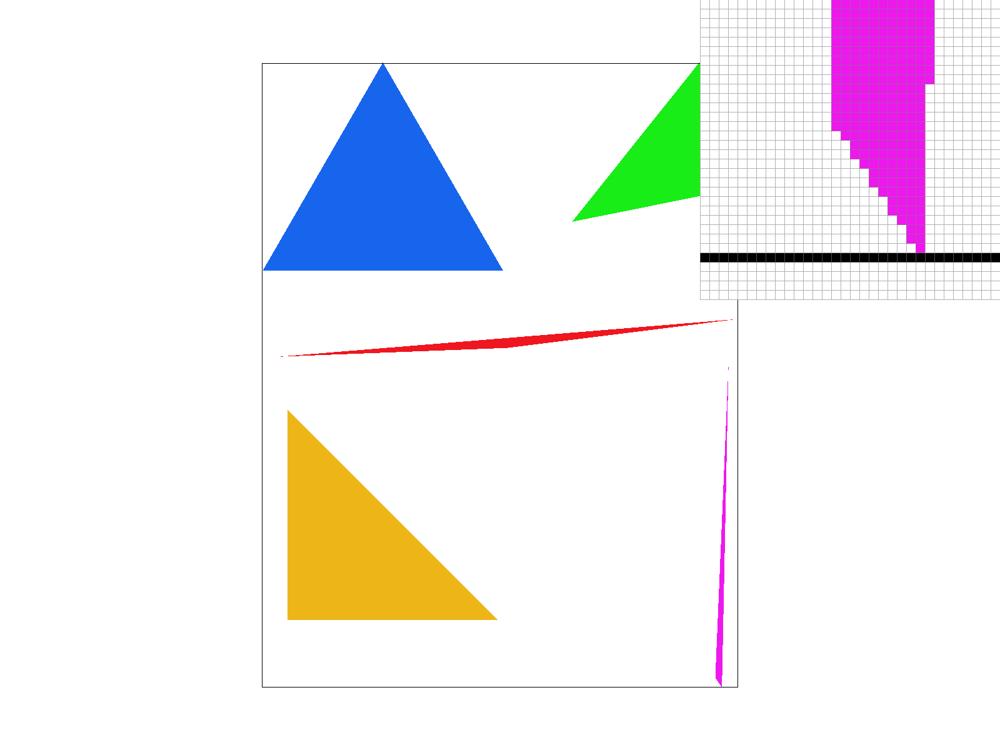

# Task 2
Since we now are increasing the number of samples by the factor `sample_rate`, we need to increase the size of the buffer from `width*height` to `width*height*sample_rate`. This is reflected in `set_sample_rate` and `set_framebuffer_target`.

First, we compute `sqrt(sample_rate)` to get the supersampling factor in each dimension. Then, we iterate over the indicies of the buffer corresponding to samples in the bounding box of the triangle. We convert the indicies `(i, j)` to real world coordinates `((i*1.0/rate)+0.5/rate, (j*1.0/rate)+0.5/rate)`. 

Using these real world coordinates, we can then perform the same 3 line tests to determine if the sampled point is in the triangle or not. 

Finally, we fill the appropriate indicies with the given color.

Also, we modified `resolve_to_framebuffer` to average over supersamples before sending them to the framebuffer.

Supersampling is useful because it simulates removing frequencies above the Nyquist frequency before sampling. It approxmiates box pre-filter antialiasing.

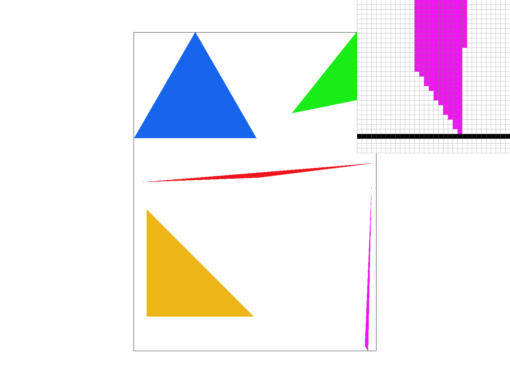
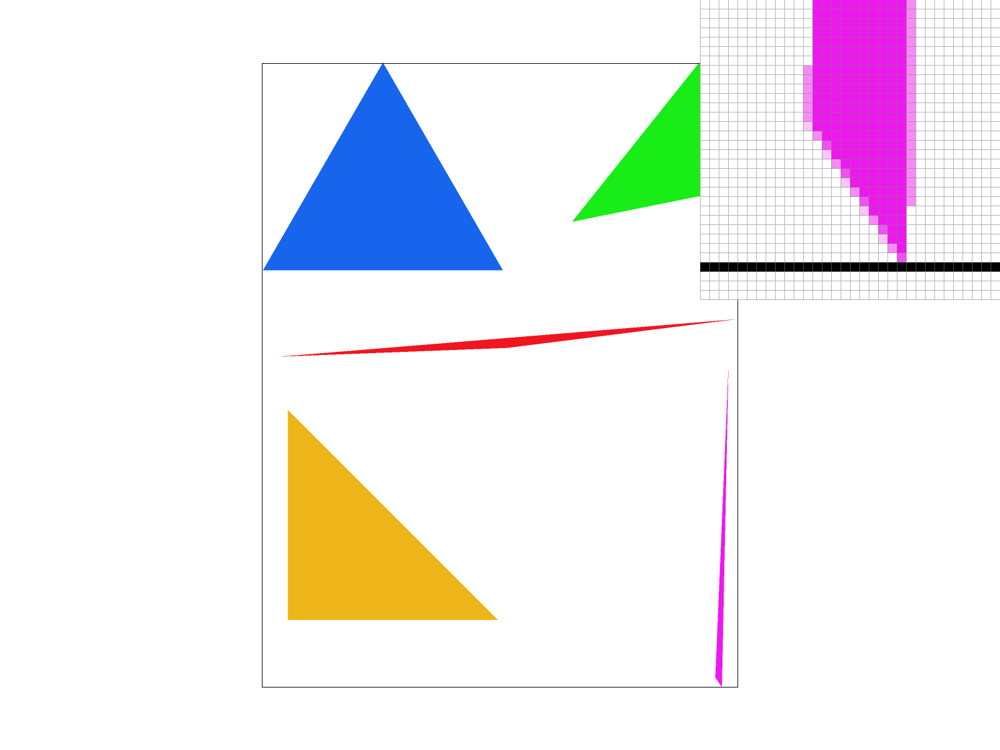

# Task 3 

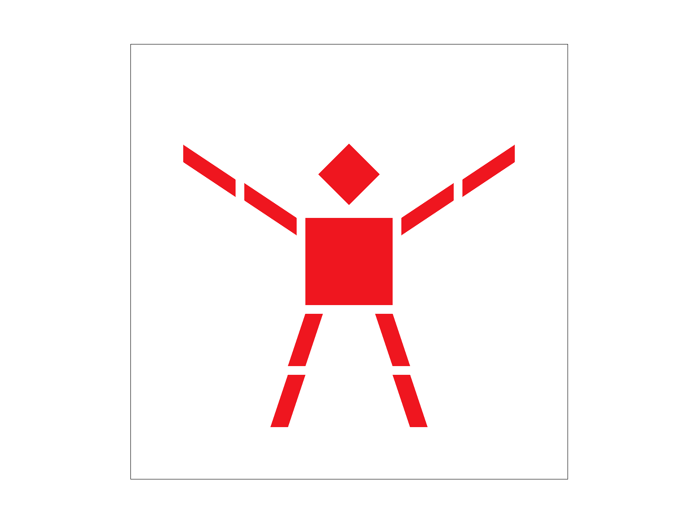

We made cubeman do jumping jacks!

# Task 4

Barycentric coordinates express a point inside of a triangle as a weighted sum of each of its vertices. Barycentric coordinates are expressed as a tuple `(a, b, c)` where `0 <= a, b, c <= 1` and `a+b+c=1`. `a` indicates how close the point is to the first vertex, `b` the second vertex, and `c` the third.

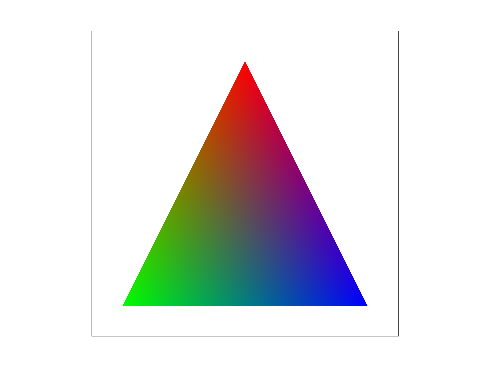

This image illustrates a triangle shaded using barycentric interpolation. As you can see, points closer to a vertex have a color more similar to that vertex, and it blends smoothly as we move towards the middle section of the triangle.

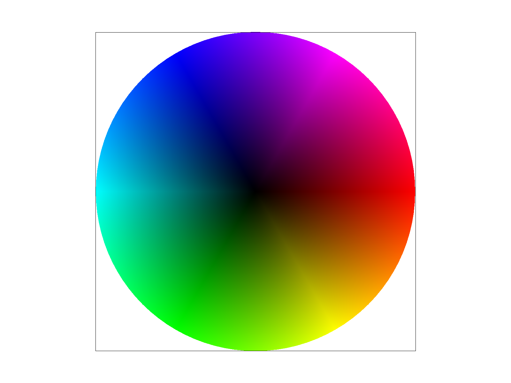

# Task 5

Pixel sampling is the process of figuring out what RGB value a pixel in the triangle should be given the triangle, the coordinates of the pixel, and the corresponding triangle in the texture. Both nearest sampling and bilenear sampling use barycentric interpolation to get from a point (x, y) to texture coordinates (u, v) given the 3 vertices of the triangle in both xy space and uv space.

Nearest pixel sampling uses the interpolated `(u, v)` coordinates and takes the color of the closest texture pixel to it.

Bilinear sampling looks at the 4 texture pixels around `(u, v)` and does bilinear interpolation between the color values of them to get the sample.

|       | Nearest | Bilinear |
| ----------- | ----------- | -|
| 1x      |  |  |
| 16x   | 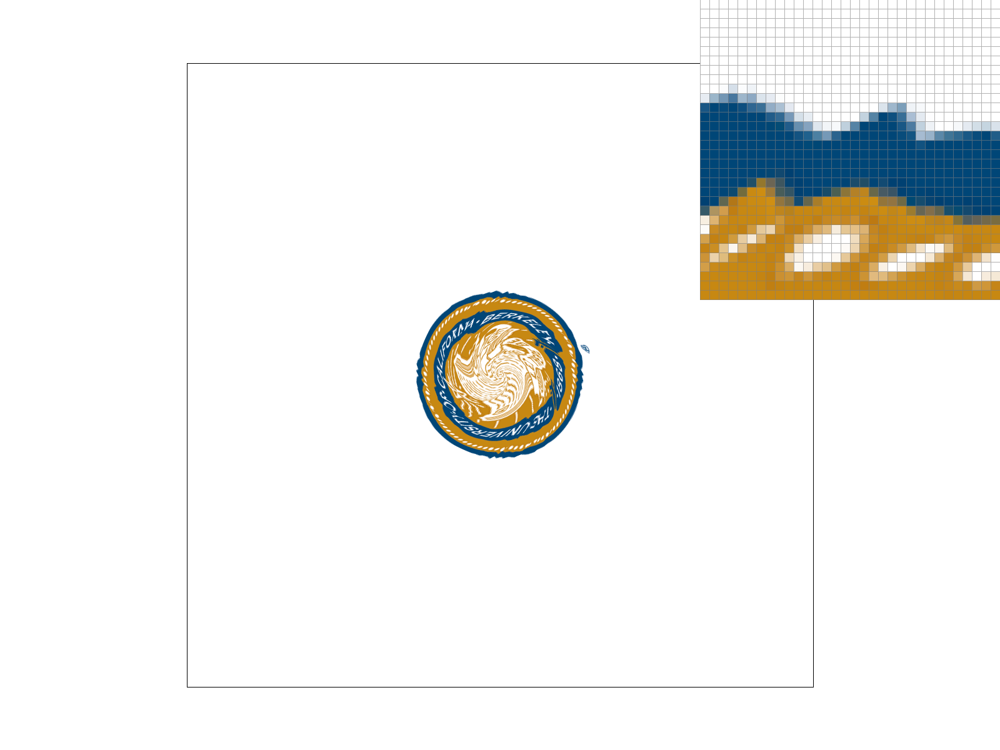 | 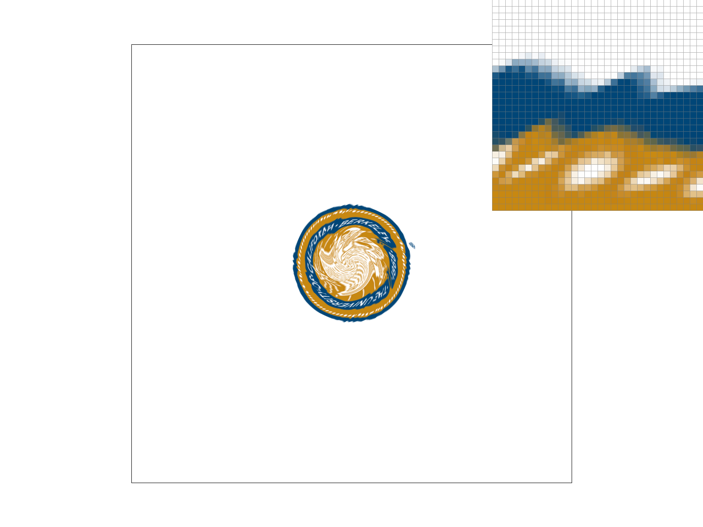 |

# Task 6
Level sampling

|       | P_NEAREST | P_LINEAR |
| ----------- | ----------- | -|
| L_ZERO      | 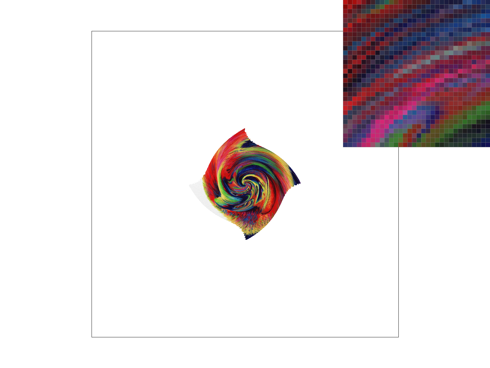 | 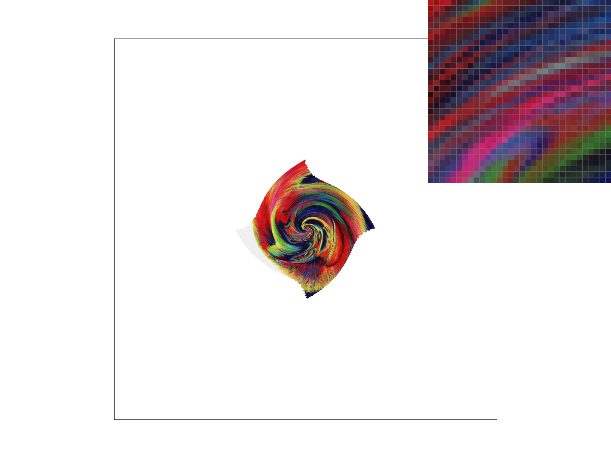 |
| L_NEAREST   | 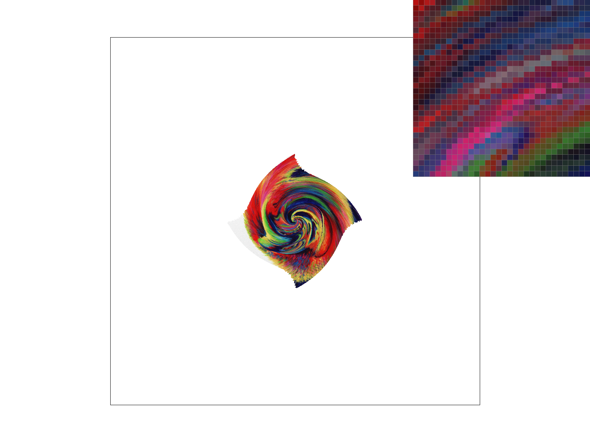 |  |