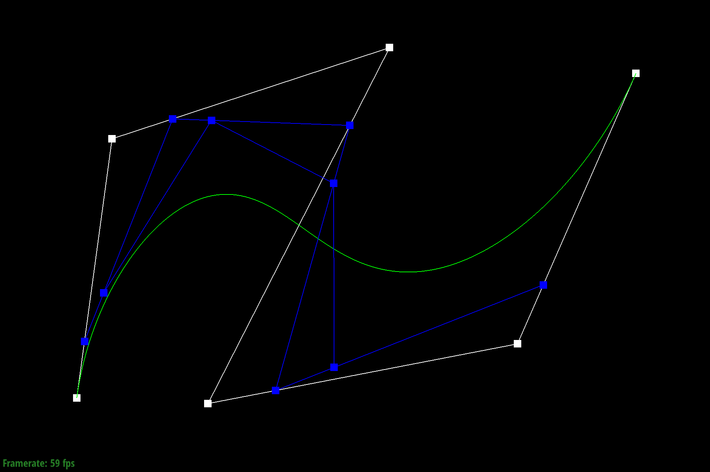
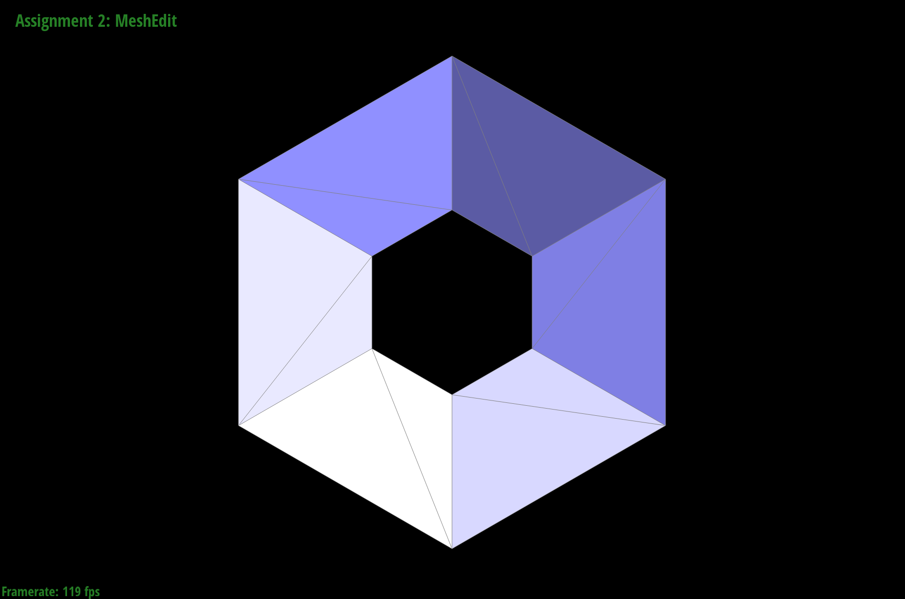
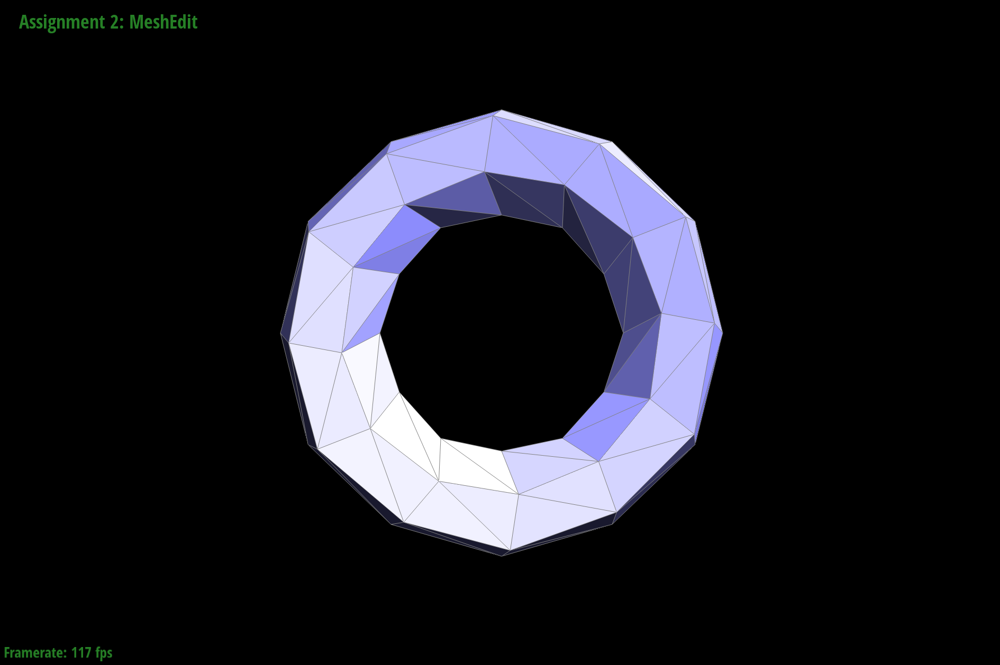
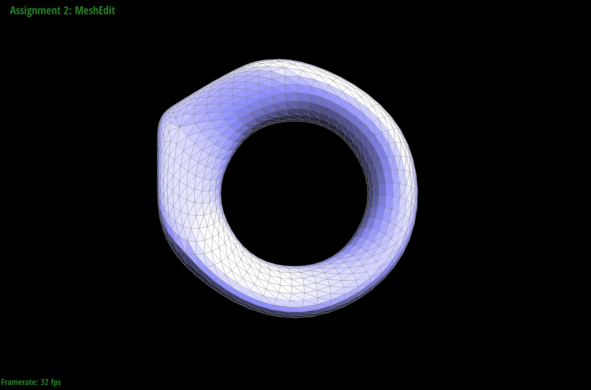
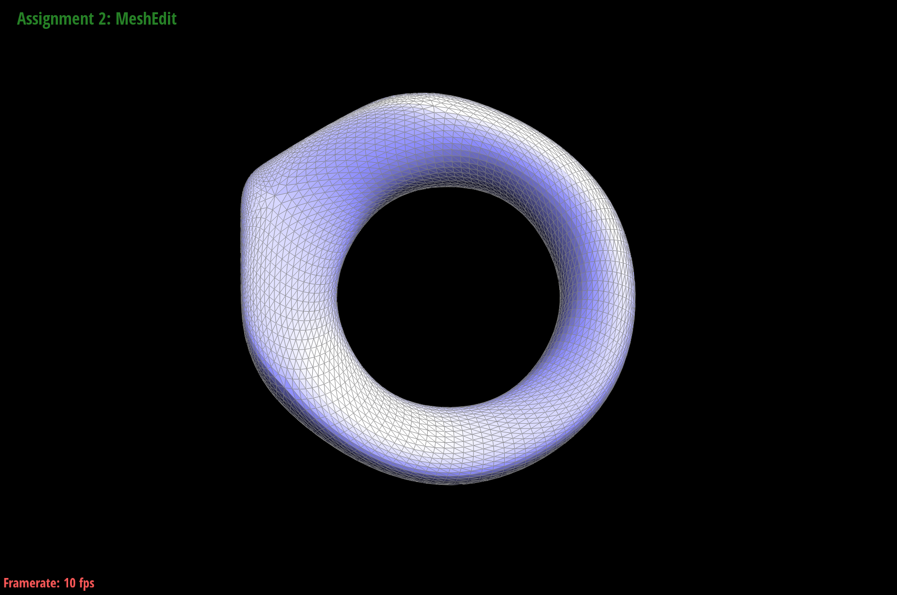

https://l-winston.github.io/184writeup/proj2/index.html

# Overview
In this project, we built Bézier curves and surfaces using de Casteljau's algorithm. We also worked closely with triangle meshes and half-edges to implement area-weighted vertext normals for smooth lighting. Finally, we implemented mesh operations including edge flipping, edge splitting, and loop subdivision.

# Task 1: Bezier Curves with 1D de Casteljau Subdivision
de Casteljau's algorithm is a way to recursively subdivide bézier curves by using successive linear interpolation. By subdividing each line segment of the control polygon, we create a new polygon with one fewer segment. Eventually we are left with a single point, which is the point on the curve at `t`.

We implemented this in `evaluateStep` by iterating through the control points and interpolating between `n` of them with paramater `t` to create a new list of `n-1` points.

|||
-|-|
Step 1|
Step 2|
Step 3|
Step 4|
Step 5|
Step 6|
Modified|

# Task 2: Bezier Surfaces with Separable 1D de Casteljau
de Casteljau's algoritm very easily extends to Bézier surfaces. We iterate over every row of points in the surface and perform 1D de Casteljau's algorithm to evaluate points at parameter `t`. Using this list of points from each row.

I copied my implementation of `evaluateStep` from `BezierCurve`. In `evaluate1D`, I recursively call `evaluateStep` to reduce the number of control points until there is only one point left, which `evaluate1D` returns. In `evaluate`, I iterate over every row of control points and evaluate them using `evaluate1D` to get a new list of control points for each row. Then, I make a final call to `evaluate1D` to evaluate the point along this new list at `t`.

# Task 3: Area-Weighted Vertex Normals

To implement area-weighted vertex normals, the first thing I did was to collect a list of `neighbors` of the given vertex by iterating through halfedges and vertices. 

Next, I iterated over every consecutive pair of `neighbors`, which each define a unique triangle with the given vertex. Then, I used these three points to get two vectors to calculate normals and area. 

Finally, I summed up the normalized cross products multiplied by triangle areas and normalized the final sum.

No vertex normals|Vertex normals
-|-
|

# Task 4: Edge Flip

I drew out a diagram that included all edges, halfedges, vertices, and faces before and after the edge flip. Then, I methodically extracted every edge/halfedge/vertex/face object from the mesh. Finally, I went through each one and reassigned the pointers so they matched the diagram of after the edge flip. 

|Original|After flipping|
|-|-|
||

My debugging journey was very simple and shortlived. I mistyped one number and did a full pass to find the mistake.

# Task 5: Edge Split

My implementation for edge split was very similar to my implementation for edge flip. First, I drew a detailed diagram that also included all elements that needed to be added. I picked an intuitive way to map existing elements from "before" to "after" and to name new elements in the "after". This made debugging very straightforwards again because all I had to do was go through all my pointer reasignments and confirm they were correct.

Original|After splitting|After splitting and flipping
-|-|-
||

# Task 6: Loop Subdivision

First, I went through each vertex in the mesh and calculated their new positions based on their neighbors and stored this in `v->newPosition`.

Next, I went through each edge and calculated the new position of the vertex that would be created when the vertex is split and stored it in `e->newPosition`.

Then, I went through every edge and split it. I made sure to mark the resulting vertex as new with `v->isNew=true` and updated the resulting vertex's `newPosition` with the position stored in the edge. I also marked the pieces of the edge that was split as `traversed` to prevent infinite looping and the new edges created as `isNew=true` to make sure I only flip new edges later.

Now, I iterated over every edge with `isNew==true` and looked at their vertices to check if the edge needed to be flipped, calling `mesh.flipEdge(e)` when neccessary.

Finally, I updated all vertices with their precalculated new positions.

I didn't really find any interesting debugging tricks but one bug I encoutered was incorrectly marking the newly created edges from split. I marked all resulting edges as `isNew=true` to prevent infinite loops, but I realized this created an issue with later flipping edges that were in the original mesh. To fix this, I created an additional field `e->traversed` to indicate the split pieces of an edge from the original mesh.

I noticed that sharp corners and edges get very smoothed out by loop subdivision and also shrink a little bit as a result.

|Subdivision|No Splitting|Pre-splitting|
|-|-|-|
|None||
|1x||
|2x||
|3x||
|4x||

As you can see, pre-splitting is pretty effective for preserving the shape of the original faces and keeping the edge angles the same.

|Subdivision|Original|Preprocessed|
|-|-|-|
None ||
1x||
2x||
3x||
4x||
5x||

The reason the original cube becomes asymetrical when subdivided is because the triangles that make up the faces are only symmetric along the diagonal. When loop subdivision is performed, it takes a weighted average of surrounding vertices which will be different at distances for vertices that should be symmetrical.

For example, the top left vertex will average over the top right and bottom left with `n=2`, but the top right vertex will average over the top left, bottom left, and bottom right with `n=3`. This creates the asymetry shown under the 1x subdivison.

To solve this, I split each face of the the cube into four symmetric and identical triangles. 