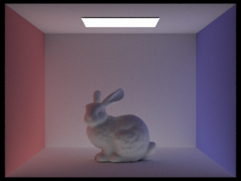

https://l-winston.github.io/184writeup/proj3-1/index.html

# Overview
An overview of the project, including your approach to and implementation for each of the parts, as well as what problems you have encountered and how you solved them. Strive for clarity and succinctness.

In this project, we implemented a renderer using a pathtracing algorithm. For the first part we wrote functions to generate camera rays and pixel samples and also implemented ray-triangle and ray-sphere intersections. For the second part, we created a BVH construction algorthm that uses maximum axis extent as a heuristic to split on, and used the BVH to implement accelerated intersection testing. For the third part, we implemented direct lighting with uniform hemisphere sampling and lighting sampling. For part 4, we implemented indirect lighting to create global illumination. For part 5, we implemented adapative sampling to concentrate samples in the more difficult parts of the image and reduce overall noise.

# Task 1: Ray Generation and Scene Intersection
For ray generation, we need to convert a set of normalized image coordinates into a `Ray` in world space. To do this, I first shifted the normalized coordinates `(x, y)` by `-0.5` so they would be centered around `(0, 0)`. Then, I scaled `x` by `2 * tan(radians(hFov/2.0))` and `y` by `2 * tan(radians(vFov/2.0))` to get a vector for the camera ray in camera space. Finally, I used the `c2w` matrix to convert from camera coordinates to world coordinates.

For pixel sample generation, I took the input unnormalized pixel coordinartes and added a sample from a unit square. This effectively samples points only from the given pixel. Then, I normalized these coordinates by dividing by the `sampleBuffer` dimensions and generated a camera ray from them. Next, I used this ray to sample estimated radiance and summed over `ns_aa` samples, averaging at the end when calling `update_pixel`.

For ray-triangle intersection, I used the Möller–Trumbore intersection algorithm. Essentially, we find the plane that the triangle lies on, which is defined by a point on the triangle and a normal vector to the triangle. Next, we find when the ray intersects with the plane, if it ever does (only will never if parallel). Finally, given the intersection point, we can use barycentric coordinates to determine if the intersection point lies within the triangle.

For ray-sphere intersection, we can use the definition of a ray and sphere to solve for intersection(s) as shown in lecture. The solution is a quadratic equation with potentially two solutions, so we need to check both and make sure that we pick the first intersection (smaller `t` value).
|||
-|-|
CBempty|
CBspheres_lambertian|

# Task 2: Bounding Volume Hierarchy
My BVH construction algorithm starts by finding the bounding box of all subelements by expanding their bounding boxes. Next, I check if `num_primitives` is less than `max_leaf_size`, in which case I set `node->start` and `node->end` and return. 

Otherwise, this node must be a parent node and we must determine how to split the primitives into seperate nodes. To do this, I found the axis with the largest extent and sorted the primitives in place using the `start` and `end` iterators. I used the midpoint of this axis as the splitting plane and sorted elements into the left or right bucket based on which side of this plane their centroid was. In the edge case where there are no elements in the left  (`p==end`) or right (`p==start`) bucket, I move one element into the empty bucket.

Finally, I recurse on buckets and set `node->l` and `node->r`.

Max
60.3737s -> 0.0416s
364141 -> 175779 rays
0.0060 -> 4.2220 million rays per second
12628.005498 -> 6.849351 intersection tests per ray

Lucy
196.2368s -> 0.0348s
193175 -> 123035 rays
0.0010 -> 3.5352 million rays per second
65913.212579 -> 2.522916 intersection tests per ray

Dragon
174.8064s -> 0.0436s
299982 -> 167555 rays
0.0017 -> 3.8461 million rays per second
33120.848501 -> 5.224386 intersection tests per ray

As you can see, BVH acceleration dramatically reduces rendering times by >1000x. This is primarily due to the BVH reducing the number of intersection tests per ray by pruning subnodes by bounding boxes.  

# Task 3: Direct Illumination

The first implementation of direct lighting function is Uniform Hemisphere Sampling. This works by intergrating over samples of light arriving in a hemisphere around the hit point. The samples of light are drawn uniformly from a hemisphere. We check if these samples intersect a light source, applying the reflection equation if there is, and average over number of samples.

The second implementation of direct lighting function is Importance Sampling Lights. Instead of picking uniform directions in a hemisphere to sample, we instead sample all the lights directly. If there is nothing blocking the line of sight from the hit point to a light, we know the light source casts light on the hit point. Using the reflectance equation, we can calculate the amount of outgoing light.

Uniform Hemisphere Sampling

Importance Sampling Lights

L=1

L=4

L=16

L=64

Uniform Hemisphere Sampling is a noisier way to check how much light a given hit point is recieving. Instead of randomly sampling directions to see if they hit a light, lighting sampling skips the randomness and only checks rays from the hit point towards all lights, resulting in a less noisy render.

# Task 4: Global Illumination
For my implementation of indirect lighting function, I randomly sampled `wi` using `sample_f`. Using this new direction, I created a `Ray` representing the incoming ray onto the hit point. After ensuring that `cos(theta)` is positive, I check for intersection on this incoming ray and make sure to normalize by all relevant factors (`f`, `cos(theta)`, `pdf`, `1-prob`).

Images with 1024 samples per pixel:

|CBspheres|CBbunny|
-|-|
|||

|Only direct|Only indirect|
-|-|
|||

|`max_ray_depth`|CBbunny|
-|-|
|0|
|1|
|2|
|3|
|100|

|`samples-per-pixel`|CBbunny|
|-|-|
|1|
|2|
|4|
|8|
|16|
|64|
|1024|

# Task 5: Adaptive Sampling

Adaptive sampling is a technique used to increase the number of sample on pixels that converge slower to minimize noise. Essentially, we concentrate samples in the more difficult parts of the image. To do this, we store the mean and standard deviation of the samples for each pixel, and calculate `I=1.96*std/sqrt(n)`, and if `I<=maxTolerance*m`, we assume the pixel has converged and stop tracing more rays for this pixel. 

|Render|Rates|
-|-|
||
||
