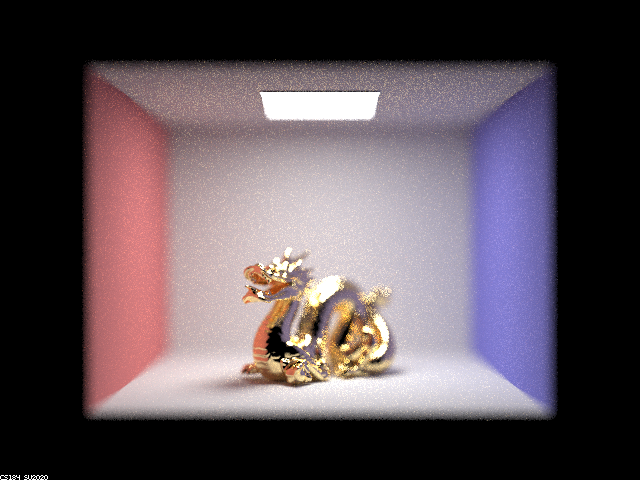

https://l-winston.github.io/184writeup/proj3-2/index.html

# Overview
For this project, we decided to do Task 1 (Mirror and Glass Materials) and Task 4 (Depth of Field). In Task 1, we implemented reflection and refractions, and used them to create a realistic glass material. In Task 4, we modified `generate_ray` to take into account the effects of a thin lens.

# Task 1: Mirror and Glass Materials 
|`max_ray_depth`||description|
-|-|-|
0||only direct lighting
1||light bounces off walls to camera
2||light reflects off left ball to camera
3||light refracts through the right ball to camera
4||light refracts through right ball and reflects off left ball to camera
5||from ray 4+ all features appear and just more paths make it to camera
100||from ray 4+ all features appear and just more paths make it to camera

# Task 4: Depth of Field

The pinhole camera model assumes that light travels through a single point in the camera to form an inverted image on a flat image plane. This model uses simple geometry and does not take into account the effects of lens distortion, which can cause image distortion or blur, particularly around the edges of the image.

The thin-lens camera model assumes that light passes through a thin lens that bends the light to form an inverted image on a flat image plane. It considers the lens as a thin optical element and uses the lens equation to capture the effects of lens distortion and can produce more accurate images than the pinhole camera model

|focal depth||
-|-|
3.5|
4|
4.5|
5|

|focal depth||
-|-|
.21|
.25|
.30|
.40|

