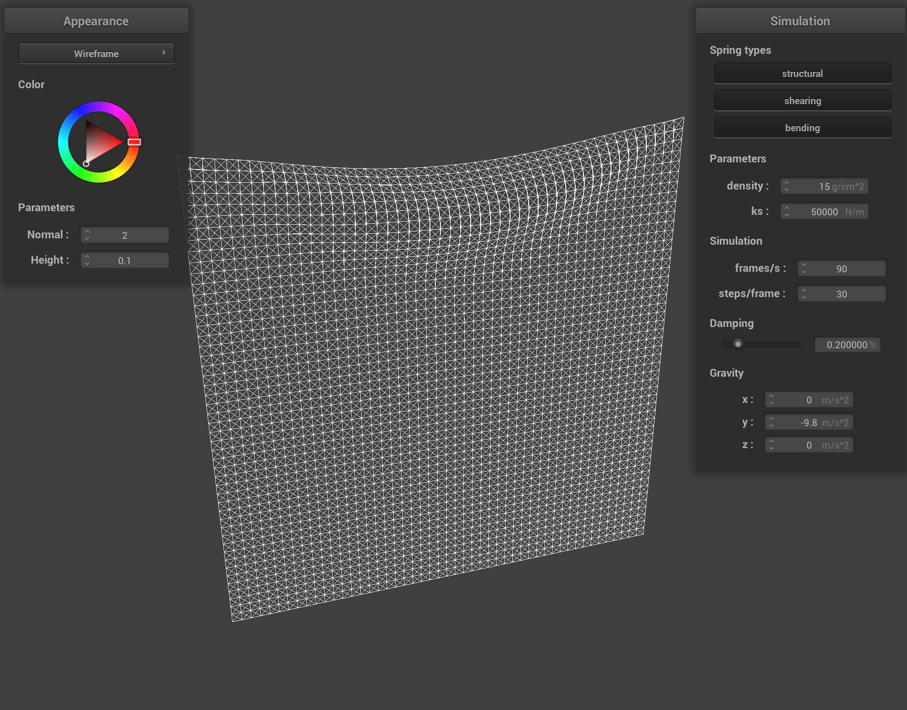
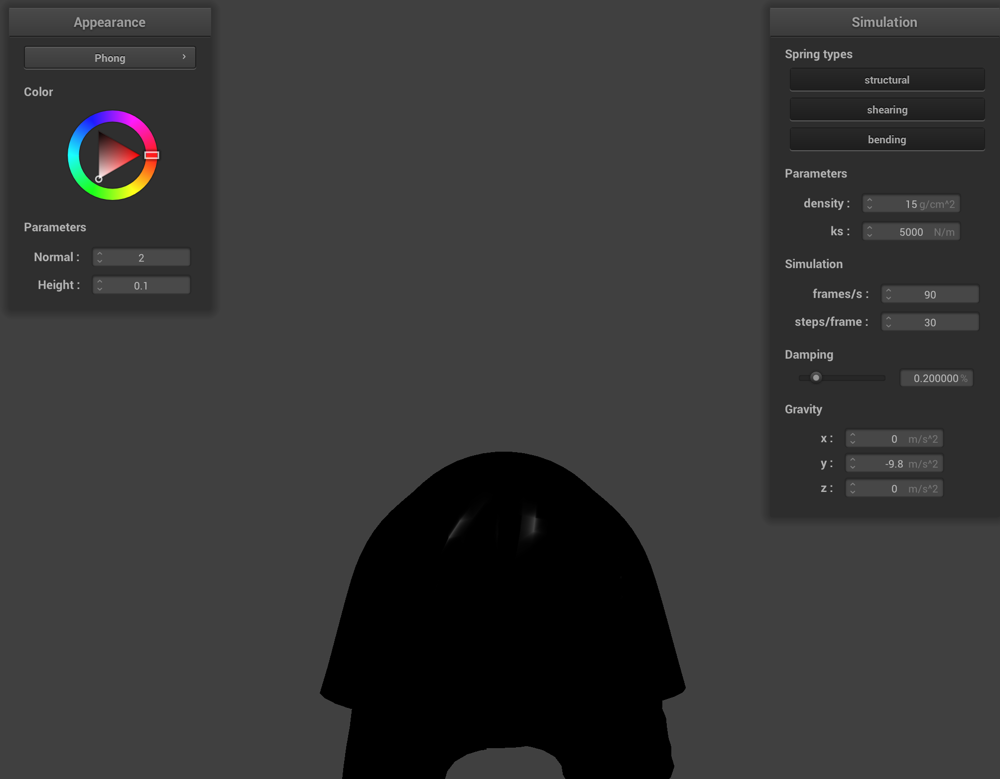

https://l-winston.github.io/184writeup/proj4/index.html

# Overview
For this project, we are implementing a real-time simulation of cloth using a mass and spring based system. We also implement self-collisions and collisions with other objects.  

# Task 1: Masses and Springs

For this part, we implemented a function Cloth::buildGrid() that uses the class parameters to build a grid with PointMasses and Springs. To do this, we iterated over the width and height of the grid num_width_points and num_height_points times, respectively. If the grid was oriented horizontally, the indices of the for loop would correspond to the (x,z) coordinates of the grid, and if it was oriented vertically, they corresponded to the (x,y) coordinates. We would set the y-coordinates of the point masses to 1 in the first case and the z-coordinates to a random offset in the range (-0.001, 0.001) in the second case. We would then check if the pinned vector contained the point mass’s position and then add the point mass to the point mass vector. Using the point mass vector, we iterated over all possible point mass positions again and added all three different kinds of springs to the spring vector using the constraints of each spring type.

# Task 2: Simulation via numerical integration

In this part of the project, we implemented cloth physics using a simulation of external forces such as gravity and spring correction forces, which utilize the springs we created in the previous section. To simulate external forces, we just calculated F = ma and applied it to every point mass on the grid. The spring correction forces required us to check if the spring’s constraint type was enabled and apply Hooke’s law to every enabled spring. Next, we used Verlet integration to calculate the new point mass positions of all unpinned point masses. We also dampened the simulation a little bit to replicate the loss of energy that comes with motion, such as friction and air resistance. For each spring, we also implemented a constraint that prevented a spring from being stretched to 110% of its original length. If a point mass is pinned, the constraint is applied entirely to the other point mass connected to the spring, and if both are unpinned, each point mass receives half of the correction.

With lower `ks`, the cloth is looser and more relaxed.

With higher `ks` the cloth looks more rigid and does not deform much froma flat plane.

At very low `density` the cloth fals smoothly and all together. 

At very high `density` the cloth sags more and the top part of the cloth falls very fast.

At very low `damping` the cloth fals rapidly and even swings back and forth because energy is conserved.

At very high `damping` the cloth floats down very gently and slowly.

# Task 3: Handling collisions with other objects

In this part of the project, we simulated cloth collisions with other objects, specifically spheres and planes. In our implementation of Sphere::collide, we checked if a point mass was inside or at the boundary of the sphere, and if so, updated its position to the sphere’s surface. This is done by finding a tangent point, computing the correction vector needed to adjust the point mass’s position, and updating the position by the correction vector scaled down by (1-f) to account for friction. For Plane::collide, we checked if a point mass passed through the plane in the previous time step. We first calculated the point where the point mass would have intersected the plane, computing another correction vector, and updating the position by the scaled correction vector again.

# Task 4: Handling self-collisions

This part of the project had us implement self-collisions. Instead of looping through all possible pairs of point masses, computing the distance between them, and applying a correction if they are too close to each other, we used a spatial hashmap for a more efficient solution. First, we built a hashmap that mapped a point mass’s position to a float that represented a specific 3D box of dimension w * h * t on the grid. We then iterated over all point masses and populated the map with the hash_position function we just implemented. The self_collide function takes in a point mass and iterates over all other point masses inside the same 3D box. For each of these point masses, we then checked if the distance between the original point mass and the candidate is less than 2thickness units, and if it was, a correction vector was computed that set the original point mass 2thickness units away from the candidate point mass. The final correction vector we apply to the point mass is the average of all these correction vectors scaled down by simulation_steps.

With a greater `ks`, the cloth is a lot stiffer. However, at the beginning, this is somewhat canceled out higher `density` which causes the cloth to hit the ground with greater force. However, as the cloth on the ground comes to a rest the higher `ks` makes it unfold and flatten out very quickly as shown below.

# Task 5: Shaders

This section of the project had us implement shaders using GLSL. The first task had us implement a diffuse shader, which uses the formula Ld = kd (I/r2) max(0, n*l) to generate a new color for a fragment. The next task had us implement Blinn-Phong shading, which uses the formula L = kaIa + kd(I/r2) max(0, n*l) + ks(I/r2) max(0, n*h)p to generate specular lighting effects. We also implemented texture mapping using the uv-coordinates to sample from a texture and bump mapping using the uv-coordinates to sample from a height map. In the displacement shader, we used the same fragment shader as the bump mapping implementation, but we also added a vertex shader, which uses normals to displace vertex positions, over it. We also implemented environment-mapped reflections by computing an outgoing eye-ray, reflecting it across the surface normal to get a direction, and then sampling the environment map with this reflection vector.

Since the texture used for the height map is quite noisy, the higher resolution sphere looks more prickly and the lower resolution sphere is less prickly.

